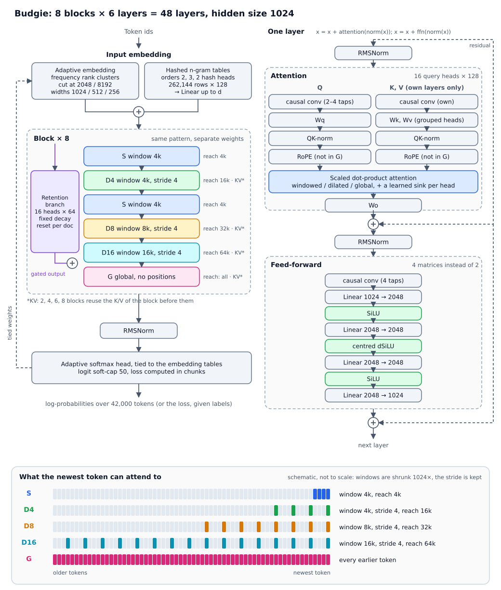

# Budgie 1

Budgie is a decoder-only language model built from **windowed, dilated and global attention layers**, with
depthwise causal convolutions in front of every attention and feed-forward block, a deeper-than-usual FFN,
hashed n-gram input embeddings and an adaptive-softmax output head. This repository holds the model code,
the tokenizer and the chat template in Hugging Face format.

**This repository is the model framework only**: modelling code, configuration, tokenizer and tests. It has no
weights, training code or data. Trained models are published on Hugging Face, in the
**Budgie1.0-1B** collection of [Hugodonotexit](https://huggingface.co/Hugodonotexit). The collection does not
exist yet; its link will be added here when it does.

The default configuration (`BudgieConfig()`) is 48 layers, hidden size 1024, 16 heads of 128 dims,
**0.98 B parameters** (0.947 B with the retention branch off), vocabulary 42,000.



> Status: the code, tokenizer and tests are working; the Budgie1.0-1B models are still being trained. Until they
> are published, the examples below build a randomly initialised model.

## Install

```bash
git clone <this repository> budgie
cd budgie
pip install -e .            # exposes the repo root as the package `budgie`
pip install -e ".[fast]"    # optional: the causal-conv1d CUDA kernel
pip install -e ".[dev]"     # optional: pytest
```

Requires Python 3.10+, `torch>=2.6` and `transformers>=5.15` (developed against transformers 5.15 and
torch 2.13). Without `causal-conv1d` the model uses an equivalent PyTorch convolution, which gives the same
results; the kernel is a little faster on GPU.

## Use

The repository root is the model directory, laid out like a Hugging Face model repo:

```
config.json               default architecture, with auto_map for trust_remote_code
generation_config.json    stops on <eos> and on <|end|> (end of a chat turn)
configuration_budgie.py   BudgieConfig
modeling_budgie.py        BudgieModel, BudgieForCausalLM
*.py                      one module per concern (attention, ffn, embeddings, head, cache, ...)
tokenizer/                tokenizer.json, tokenizer_config.json, special_tokens_map.json, chat_template.jinja
```

The modules are flat on purpose: `trust_remote_code` copies only same-directory imports next to a
checkpoint, so a saved checkpoint is self-contained.

### Build a model

```python
import budgie                                    # registers the Auto classes
from transformers import AutoConfig, AutoModelForCausalLM

config = AutoConfig.from_pretrained(".")         # or budgie.BudgieConfig(num_blocks=4, ...)
model = AutoModelForCausalLM.from_config(config)
print(config.num_hidden_layers, sum(p.numel() for p in model.parameters()) / 1e9)
```

### Load a checkpoint

Models in the [Budgie1.0-1B collection](https://huggingface.co/Hugodonotexit) (once it exists) are checkpoint
directories: weights, `config.json`, the tokenizer and a copy of the code files, as written by `save_pretrained`.
They load anywhere, without this repository installed:

```python
from transformers import AutoModelForCausalLM, AutoTokenizer

model = AutoModelForCausalLM.from_pretrained("Hugodonotexit/<model name>", trust_remote_code=True)
tok = AutoTokenizer.from_pretrained("Hugodonotexit/<model name>")
```

`<model name>` is a model in the collection; a local checkpoint directory works the same way.

Inside this repository, the tokenizer is in a subfolder: `AutoTokenizer.from_pretrained(".", subfolder="tokenizer")`.

### Things that differ from a usual causal LM

* **`logits` are log-probabilities.** The adaptive softmax normalises over the whole vocabulary, so without
  `labels` the model returns `log_softmax` output (in token-id order), not raw logits. Pass `labels` to get
  the loss; the logits are then not materialised (`logits=None`).
* **The cache is a `BudgieCache`.** Each layer keeps only the keys a later query can still see (window ×
  dilation tokens, everything for global layers, nothing for layers that read another layer's K/V), plus the
  convolution states. `generate()` creates one for you.
* **Single-token decoding runs as a CUDA graph.** On a GPU, `decode.py` replays one captured graph per generated
  token (fixed-size ring buffers for K/V, conv and retention states updated in place) instead of launching
  ~6000 small kernels, which makes decoding about 10x faster at 1k-4k tokens of context and about 7x at 16k.
  It is used for unpadded, `no_grad`, single-token steps; padded batches, beam search, `inputs_embeds` and CPU
  take the eager path, and the cache hands its state back whenever anything else needs it. Set
  `BUDGIE_FAST_DECODE=0` to turn it off.
* **The tokenizer wraps raw text in `<bos> … <eos>`.** `tok("text")` ends with `<eos>`, which is wrong for a
  prompt you want continued. For continuation use `tok(text, add_special_tokens=False)` after prepending
  `tok.bos_token` yourself, or use the chat template. For scoring benchmarks (e.g. lm-evaluation-harness) turn
  the automatic BOS off in the harness, or the scores are meaningless.
* **Documents are separated by `<bos>`.** The retention branch resets its state at every `<bos>`.

### Chat, thinking and tools

```python
msgs = [{"role": "user", "content": "What is 17 * 23?"}]

tok.apply_chat_template(msgs, add_generation_prompt=True, tokenize=False)
# <bos><|user|>\nWhat is 17 * 23?<|end|>\n<|assistant|>\n

tok.apply_chat_template(msgs, add_generation_prompt=True, tokenize=False, enable_thinking=False)
# ... <|assistant|>\n<think>\n\n</think>\n\n          (thinking switched off)
```

`enable_thinking` defaults to on. The template also handles `reasoning_content`, `tools=[...]` and
`tool_calls`; see [docs/tokenizer.md](docs/tokenizer.md) for the exact format. Note that no checkpoint has been
trained on the thinking and tool tokens yet.

## Architecture in short

* **Layers.** A block is `S D4 S D8 D16 G`, repeated `num_blocks` times (8 by default → 48 layers). `S` is local
  attention (window 4096), `D4`, `D8` and `D16` are dilated (stride 4: windows of 4096, 8192 and 16384 tokens,
  reaching 16k, 32k and 64k back), `G` is global attention without positional encoding. Every layer is
  `x += attn(norm(x))` then `x += ffn(norm(x))`.
* **Attention.** Grouped-query, with a depthwise causal convolution on Q and another on K/V, QK-norm, rotary
  positions (not in `G`), and a learned sink logit per head. Every second block (2nd, 4th, …) reuses the K/V of the block
  before them in their `D4`, `D8`, `D16` and `G` layers (`kv_share`), which cuts the KV cache.
* **FFN.** A causal convolution, then four matrices `d → 2048 → 2048 → 2048 → d`; SiLU after the first and last hidden
  layer and a centred dSiLU after the middle one.
* **Embeddings.** A frequency-sorted adaptive embedding (clusters of width d, d/2, d/4) plus hashed 2- and 3-gram
  tables with two independent hash heads each, projected up to the hidden size. The output head is an adaptive
  softmax tied to the same tables, with logits soft-capped at 50.
* **Retention branch (optional, on by default).** A fixed-decay linear-attention branch per block (16 heads × 64)
  that writes a gated term into the residual stream just before the block's first `G` layer. `linear_branch="none"` removes it
  (no modules, and no `lin_*` keys in `config.json`).

[docs/architecture.md](docs/architecture.md) describes each part and every configuration field.

## Tests

```bash
pytest tests                # CPU only, about 15 s
```

They cover shapes and log-probabilities, causality, cached decoding against a full forward pass, `generate`,
configuration validation, `save_pretrained` → `from_pretrained` including loading in a fresh process with
`trust_remote_code`, and the tokenizer, special tokens and chat template. `tests/test_decode.py` checks the
CUDA-graph decode path against the eager one and is skipped when there is no GPU.

## Repository layout

| Path | Contents |
|---|---|
| `configuration_budgie.py` | `BudgieConfig`, its validation and the derived layer tables |
| `modeling_budgie.py` | `BudgieModel`, `BudgieForCausalLM`, Auto registration |
| `attention.py`, `patterns.py`, `sdpa.py` | attention layer, local / dilated / global patterns, SDPA with sinks |
| `feedforward.py`, `activations.py`, `convolution.py` | FFN, centred dSiLU, causal convolution |
| `embeddings.py`, `head.py` | adaptive + n-gram input, adaptive-softmax head |
| `retention.py` | the retention branch |
| `cache.py` | `BudgieCache` |
| `decode.py` | the CUDA-graph decode path (ring-buffer state, captured single-token step) |
| `norms.py`, `rotary.py`, `decoder.py` | RMSNorm / QKNorm, rotary embeddings, decoder layer |
| `tokenizer/` | tokenizer and chat template |
| `config.json`, `generation_config.json` | default architecture and generation settings |
| `tests/` | pytest suite |
| `docs/` | architecture and tokenizer notes, and the structure diagram (`structure.svg`, drawn from `config.json` by `make_structure_diagram.py`) |

## Licence

The code, configuration and tokenizer in this repository are released under the
[Apache License 2.0](LICENSE) (see also [NOTICE](NOTICE)). The weights of the models in the Budgie1.0-1B
collection are published separately on Hugging Face, and each model's page states its own licence.
